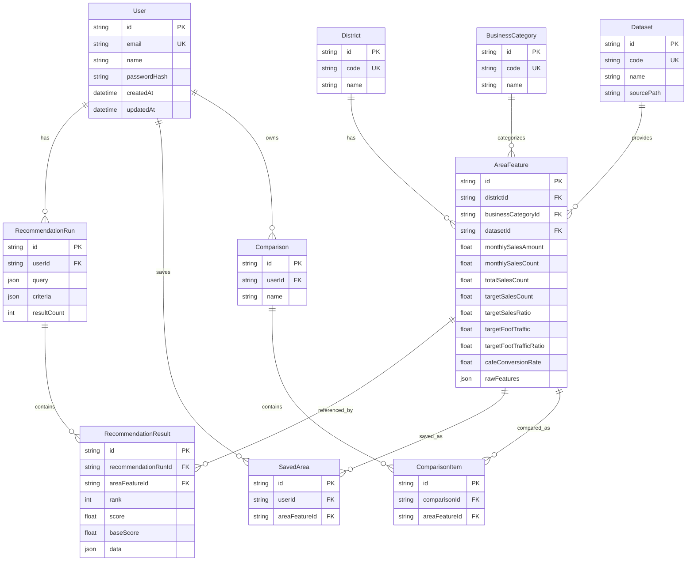

# 황금을 찾아라 개발 정리 문서

이 문서는 현재까지 진행한 다중 업종 상권 추천 서비스의 데이터 전처리, 점수 산정, 백엔드, 데이터베이스, ERD, 프론트엔드 연결, 배포 환경변수까지 한 번에 읽을 수 있도록 정리한 문서이다.

## 1. 프로젝트 개요

서비스 이름은 `황금을 찾아라`이며, 서울 행정동 단위의 업종별 창업 후보 상권을 추천하는 서비스이다. 초기에는 커피-음료 중심으로 시작했지만, 최근 업종 확장 작업을 통해 한식, 중식, 일식, 양식, 분식, 치킨, 제과점, 패스트푸드, 편의점까지 다룰 수 있는 구조로 확장했다.

핵심 목표는 다음과 같다.

- 서울 상권 데이터와 유동인구 데이터를 전처리한다.
- 선택 업종에 맞는 매출, 유동인구, 전환효율 파생변수를 만든다.
- 행정동별 추천 점수를 계산한다.
- 데이터 신뢰도를 함께 계산해서 과도한 이상치 추천을 줄인다.
- 추천 결과를 프론트엔드에서 업종별로 시각화한다.
- 로그인 사용자는 추천 상권을 저장하고 비교함에 담을 수 있다.
- 추천 설명은 규칙 기반 설명을 기본으로 하고, 설정에 따라 OpenAI 또는 로컬 LLM 설명을 사용할 수 있다.

## 2. 전체 폴더 구조

주요 폴더는 다음과 같이 구성했다.

```txt
T_sum/
  data_analysis/
    data/
      raw/
        유동인구.csv
        추정매출.csv
      processed/
        category_config.py
        pop.py
        sales.py
        process.py
        pop_features.csv
        sales_features.csv
        cafe_sales_features.csv
        area_features.csv
        cafe_area_features.csv

  backend/
    prisma/
      schema.prisma
      seed.js
      migrations/
    src/
      controllers/
      middlewares/
      routes/
      schemas/
      services/
      app.js
      server.js
    .env.example
    package.json

  frontend/
    src/
      app/
        auth/
        components/
        lib/
        pages/
        routes.tsx
    .env.example
    package.json

  docker-compose.yml
```

## 3. 데이터 원천

사용한 원천 데이터는 크게 두 가지이다.

| 구분 | 파일 | 역할 |
|---|---|---|
| 유동인구 데이터 | `data_analysis/data/raw/유동인구.csv` | 행정동별, 연령대별, 시간대별 유동인구 feature 생성 |
| 추정매출 데이터 | `data_analysis/data/raw/추정매출.csv` | 여러 업종의 행정동별 매출, 매출건수, 객단가, 시간대 매출 feature 생성 |

현재 분석 대상 업종은 `커피-음료`, `한식음식점`, `중식음식점`, `일식음식점`, `양식음식점`, `분식전문점`, `치킨전문점`, `제과점`, `패스트푸드점`, `편의점`이다. 기존 호환을 위해 커피-음료 단일 업종 산출물도 계속 생성한다.

분석 대상 기간은 코드상 `20251`, `20252`, `20253`, `20254` 분기이다.

## 4. 데이터 전처리 파이프라인

전처리는 `data_analysis/data/processed` 폴더의 세 파일로 정리했다.

| 파일 | 역할 |
|---|---|
| `pop.py` | 유동인구 데이터 전처리 |
| `sales.py` | 매출 데이터 전처리 |
| `process.py` | 유동인구 feature와 매출 feature 병합, 최종 feature 생성 |

현재 기준 최종 산출물은 다중 업종 feature 파일이다.

```txt
data_analysis/data/processed/area_features.csv
```

기존 커피-음료 서비스 호환을 위해 다음 파일도 함께 생성한다.

```txt
data_analysis/data/processed/cafe_area_features.csv
```

## 5. 유동인구 전처리

유동인구 전처리는 `pop.py`에서 수행한다.

### 5.1 필터링

- 원천 유동인구 CSV를 읽는다.
- 기준 분기 코드가 `20251`, `20252`, `20253`, `20254`인 데이터만 사용한다.
- 행정동 단위로 그룹화한다.

### 5.2 집계 기준

행정동 단위 그룹키는 다음과 같다.

```txt
행정동_코드
행정동_코드_명
```

집계 방식은 평균이다. 유동인구 데이터의 `총_유동인구_수`는 일 단위가 아니라 주간 기준 성격의 데이터로 해석했기 때문에, 이후 월 추정값을 만들 때 단순히 30을 곱하지 않도록 수정했다.

### 5.3 생성한 유동인구 feature

주요 feature는 다음과 같다.

| 컬럼 | 의미 |
|---|---|
| `총_유동인구_수` | 행정동의 평균 총 유동인구 |
| `연령대_10_유동인구_수` | 10대 유동인구 |
| `연령대_20_유동인구_수` | 20대 유동인구 |
| `연령대_30_유동인구_수` | 30대 유동인구 |
| `연령대_40_유동인구_수` | 40대 유동인구 |
| `연령대_50_유동인구_수` | 50대 유동인구 |
| `연령대_60_이상_유동인구_수` | 60대 이상 유동인구 |
| `2030_유동인구` | 20대 + 30대 유동인구 |
| `2030_유동인구비율` | 2030 유동인구 / 총 유동인구 |
| `새벽_유동인구비중` | 00~06 유동인구 / 총 유동인구 |
| `오전_유동인구비중` | 06~11 유동인구 / 총 유동인구 |
| `점심_유동인구비중` | 11~14 유동인구 / 총 유동인구 |
| `오후_유동인구비중` | 14~17 유동인구 / 총 유동인구 |
| `저녁_유동인구비중` | 17~21 유동인구 / 총 유동인구 |
| `심야_유동인구비중` | 21~24 유동인구 / 총 유동인구 |

### 5.4 2030 유동인구 계산

```txt
2030_유동인구 = 연령대_20_유동인구_수 + 연령대_30_유동인구_수
```

```txt
2030_유동인구비율 = 2030_유동인구 / 총_유동인구_수
```

처음에는 2030만 고정으로 사용했지만, 이후 서비스에서는 `targetAges` query를 받아 20,30 외에도 10,40,50,60대까지 선택할 수 있도록 확장했다.

다만 최종 CSV에는 기존 호환성을 위해 `2030_유동인구`, `2030_유동인구비율` 컬럼이 남아 있다.

## 6. 매출 전처리

매출 전처리는 `sales.py`에서 수행한다.

### 6.1 필터링

- 원천 추정매출 CSV를 읽는다.
- 업종명이 `커피-음료`인 데이터만 사용한다.
- 기준 분기 코드가 `20251`, `20252`, `20253`, `20254`인 데이터만 사용한다.

### 6.2 행 단위 파생변수

분기별 row에서 먼저 다음 값을 만든다.

| 컬럼 | 계산식 |
|---|---|
| `총매출건수` | 10대~60대 이상 연령별 매출건수 합 |
| `2030_매출건수` | 20대 매출건수 + 30대 매출건수 |
| `2030_매출비율` | 2030_매출건수 / 총매출건수 |
| `객단가` | 당월_매출_금액 / 당월_매출_건수 |
| `피크타임_매출비중` | 시간대별 매출금액 중 최대값 / 당월_매출_금액 |
| `시간대추천` | 시간대별 매출금액이 가장 큰 시간대 |

### 6.3 행정동 단위 집계

행정동 단위 그룹키는 다음과 같다.

```txt
행정동_코드
행정동_코드_명
```

집계 방식은 다음과 같다.

| 항목 | 집계 방식 |
|---|---|
| 당월 매출 금액 | 합산 후 집계 기간 수로 나누어 대표값 생성 |
| 당월 매출 건수 | 합산 후 집계 기간 수로 나누어 대표값 생성 |
| 연령대별 매출건수 | 합산 후 집계 기간 수로 나누어 대표값 생성 |
| 연령대별 매출금액 | 합산 후 집계 기간 수로 나누어 대표값 생성 |
| 시간대별 매출금액 | 합산 후 집계 기간 수로 나누어 대표값 생성 |
| 시간대추천 | 최빈값 |
| 피크타임_매출비중 | 평균 |

`집계_기간수`는 해당 행정동에 존재하는 고유 분기 개수이다.

### 6.4 분기별 매출 안정성

분기별 매출 안정성은 분기별 매출건수의 변동계수를 사용해 계산했다.

```txt
변동계수 = 표준편차 / 평균
분기별_매출안정성 = 1 / (1 + 변동계수)
```

해석은 다음과 같다.

- 값이 1에 가까울수록 분기별 매출 변동이 작다.
- 값이 0에 가까울수록 분기별 매출 변동이 크다.
- 데이터가 부족하면 기본값 0.5를 사용한다.

## 7. 최종 feature 병합

최종 병합은 `process.py`에서 수행한다.

### 7.1 병합 기준

매출 feature와 유동인구 feature를 다음 키로 병합한다.

```txt
행정동_코드
행정동_코드_명
```

### 7.2 월 유동인구 추정 수정

초기에는 다음 계산을 사용했다.

```txt
월_유동인구추정 = 총_유동인구_수 * 30
```

하지만 `총_유동인구_수`가 일 단위가 아니라 주 단위 성격의 데이터라는 점을 확인했기 때문에 이 방식은 잘못되었다. 주 단위 데이터에 30을 곱하면 약 210일 기준으로 과대 추정된다.

그래서 현재는 다음 보정계수를 사용한다.

```txt
WEEKS_PER_MONTH = 365.25 / 12 / 7
```

즉,

```txt
WEEKS_PER_MONTH ≈ 4.348
```

현재 계산식은 다음과 같다.

```txt
월_유동인구추정 = 총_유동인구_수 * WEEKS_PER_MONTH
```

### 7.3 카페전환효율

카페전환효율은 유동인구 대비 실제 카페 매출건수가 얼마나 발생했는지를 보는 지표이다.

```txt
카페전환효율 = 당월_매출_건수 / 월_유동인구추정
```

2030 기준 전환효율은 다음과 같이 계산한다.

```txt
2030_카페전환효율 = 2030_매출건수 / (2030_유동인구 * WEEKS_PER_MONTH)
```

현재 추천 점수에서는 고정된 `2030_카페전환효율` 자체를 그대로 쓰기보다는, 선택된 타깃 연령대의 매출건수와 유동인구를 조합해 타깃 기준 지표를 계산하는 쪽으로 확장했다.

## 8. 최종 CSV 주요 컬럼

기존 커피-음료 단일 업종 호환 파일은 다음 경로에 생성된다.

```txt
data_analysis/data/processed/cafe_area_features.csv
```

주요 컬럼은 다음과 같다.

| 분류 | 컬럼 |
|---|---|
| 행정동 정보 | `행정동_코드`, `행정동_코드_명` |
| 매출 | `당월_매출_금액`, `당월_매출_건수`, `총매출건수` |
| 타깃 매출 | `2030_매출건수`, `2030_매출비율` |
| 시간대 매출 | `새벽_매출비중`, `오전_매출비중`, `점심_매출비중`, `오후_매출비중`, `저녁_매출비중`, `심야_매출비중` |
| 운영 추천 | `피크타임_매출비중`, `시간대추천` |
| 객단가 | `객단가` |
| 안정성 | `집계_기간수`, `분기별_매출안정성` |
| 유동인구 | `총_유동인구_수`, 연령대별 유동인구, 시간대별 유동인구 |
| 타깃 유동인구 | `2030_유동인구`, `2030_유동인구비율` |
| 전환효율 | `월_유동인구추정`, `카페전환효율`, `2030_카페전환효율` |

## 9. 추천 점수 계산 방식

추천 점수 계산은 백엔드의 `dataStore.service.js`에서 수행한다.

추천 API는 다음 query를 유지한다.

```txt
time
targetAges
limit
useAdjustedScore
minQualityScore
allowLowConfidenceTop
ai
```

### 9.1 시간대 옵션

| value | 라벨 | 시간대 |
|---|---|---|
| `dawn` | 새벽 | 00~06 |
| `morning` | 오전 | 06~11 |
| `lunch` | 점심 | 11~14 |
| `afternoon` | 오후 | 14~17 |
| `evening` | 저녁 | 17~21 |
| `night` | 심야 | 21~24 |

### 9.2 타깃 연령대

기본 타깃은 20대, 30대이다.

```txt
targetAges=20,30
```

서비스에서는 `10,20,30,40,50,60`을 선택할 수 있다.

타깃 매출건수와 타깃 유동인구는 선택된 연령대 컬럼을 합산해서 계산한다.

### 9.3 점수 가중치

현재 추천 점수 가중치는 다음과 같다.

| 지표 | 가중치 |
|---|---:|
| 카페전환효율 | 30% |
| 타깃 매출비율 | 25% |
| 타깃 유동인구 규모 | 20% |
| 선택 시간대 매출비중 | 15% |
| 객단가 | 10% |

계산 흐름은 다음과 같다.

1. 각 지표를 행정동 전체 분포 기준으로 0~1 정규화한다.
2. 정규화 점수에 가중치를 곱한다.
3. 합산해서 `baseScore`를 만든다.
4. 데이터 신뢰도 보정계수인 `reliabilityFactor`를 곱해 최종 `score`를 만든다.

```txt
baseScore = weighted_normalized_score * 100
score = baseScore * reliabilityFactor
```

### 9.4 이상치 보정 점수

`useAdjustedScore=true`이면 정규화 범위를 단순 최소/최대가 아니라 분위수 기반으로 잡는다.

현재 방식은 다음과 같다.

```txt
min = 1% 분위수
max = 99% 분위수
```

이 방식은 극단적인 값 하나가 전체 점수 범위를 왜곡하는 문제를 줄이기 위한 것이다.

주의할 점은 이상치를 실제로 CSV에서 삭제하는 것이 아니라, 점수 정규화 범위를 보정하는 방식이라는 점이다.

## 10. 데이터 신뢰도 계산

데이터 신뢰도는 추천 점수와 별도로 계산한다. 추천 점수가 높더라도 데이터 신뢰도가 낮으면 `검토 후보`로 분류될 수 있다.

### 10.1 신뢰도 구성 요소

현재 신뢰도 가중치는 다음과 같다.

| 요소 | 가중치 |
|---|---:|
| 총 매출건수 규모 | 30% |
| 총 유동인구 규모 | 20% |
| 타깃 유동인구 규모 | 20% |
| 분기별 매출 안정성 | 20% |
| 카페전환효율 이상치 여부 | 10% |

### 10.2 신뢰도 점수

각 요소를 0~1로 정규화한 뒤 가중합을 만든다.

```txt
dataQuality.score =
  salesVolumeScore * 0.30
  + populationScore * 0.20
  + targetPopulationScore * 0.20
  + salesStabilityScore * 0.20
  + outlierScore * 0.10
```

마지막에 100을 곱해 0~100점으로 표시한다.

### 10.3 신뢰도 등급

| 점수 | 등급 |
|---:|---|
| 80 이상 | 높음 |
| 60 이상 | 보통 |
| 40 이상 | 주의 |
| 0 이상 | 낮음 |

### 10.4 신뢰도 보정계수

최종 추천 점수에는 신뢰도 보정계수 `reliabilityFactor`가 곱해진다.

현재 계산식은 다음과 같다.

```txt
reliabilityFactor = 0.55 + (dataQuality.score / 100) * 0.45
```

이 식을 사용한 이유는 다음과 같다.

- 신뢰도가 낮다고 해서 추천 점수를 0에 가깝게 완전히 죽이지 않기 위해 하한을 0.55로 둔다.
- 신뢰도가 100점이면 보정계수는 1.0이 된다.
- 신뢰도가 0점이면 보정계수는 0.55가 된다.
- 즉, 낮은 신뢰도 데이터는 점수를 낮추되, 후보군에서 완전히 제거하지는 않는다.

예시는 다음과 같다.

| dataQuality.score | reliabilityFactor |
|---:|---:|
| 100 | 1.000 |
| 80 | 0.910 |
| 60 | 0.820 |
| 40 | 0.730 |
| 0 | 0.550 |

### 10.5 추천 등급

기본 최소 신뢰도 기준은 60점이다.

```txt
minQualityScore=60
```

신뢰도가 기준 이상이면 다음 등급을 준다.

```txt
안정 추천
```

기준 미만이면 다음 등급을 준다.

```txt
검토 후보
```

`allowLowConfidenceTop=false`일 때는 안정 추천 후보를 먼저 정렬하고, 그 안에서 점수순으로 정렬한다.

## 11. LLM 설명 기능

설명 기능은 `aiReason.service.js`에서 관리한다.

### 11.1 규칙 기반 설명

기본 설명은 규칙 기반이다. 추천 결과의 주요 지표를 보고 다음과 같은 문장을 생성한다.

- 카페전환효율이 높다.
- 타깃 매출비율이 높다.
- 선택 시간대 매출비중이 높다.
- 객단가가 높다.
- 타깃 유동인구 비율이 높다.

### 11.2 로컬 LLM

초기에는 Ollama 기반 로컬 LLM을 붙였다.

기본 설정은 다음과 같았다.

```env
LOCAL_LLM_PROVIDER=ollama
LOCAL_LLM_URL=http://localhost:11434/api/generate
LOCAL_LLM_MODEL=llama3.1
```

로컬 LLM은 개인정보와 비용 측면에서 장점이 있지만, 배포 환경에서는 서버에 Ollama가 없으면 호출할 수 없다.

### 11.3 OpenAI GPT-5 nano

배포 이후에는 OpenAI API를 사용하도록 확장했다.

주요 설정은 다음과 같다.

```env
EXPLANATION_PROVIDER=openai
OPENAI_API_KEY=...
OPENAI_MODEL=gpt-5-nano
OPENAI_TIMEOUT_MS=15000
```

OpenAI Responses API를 먼저 검토했지만, `status=incomplete`와 reasoning-only output 문제가 발생했기 때문에 MVP에서는 Chat Completions API 방식으로 변경했다.

현재 원칙은 다음과 같다.

- `EXPLANATION_PROVIDER=openai`이면 로컬 LLM을 호출하지 않는다.
- OpenAI 호출 성공 시 `aiReason.mode = "openai"`로 반환한다.
- 실패 시 규칙 기반 설명으로 fallback하고 `aiReason.mode = "rule-fallback"`으로 반환한다.
- `temperature`는 보내지 않는다.

## 12. 백엔드 구조

백엔드는 Node.js + Express 기반이다.

초기에는 단일 파일에 가까웠지만, 이후 서비스 확장을 위해 다음 구조로 정리했다.

```txt
backend/src/
  app.js
  server.js
  controllers/
  middlewares/
  routes/
  schemas/
  services/
```

각 폴더 역할은 다음과 같다.

| 폴더 | 역할 |
|---|---|
| `controllers` | HTTP 요청/응답 처리 |
| `routes` | URL과 controller 연결 |
| `services` | 비즈니스 로직, DB 접근, 추천 계산 |
| `schemas` | 요청 validation, 공통 에러 생성 |
| `middlewares` | CORS, 인증, 에러 처리, method guard |

## 13. 사용한 데이터베이스

데이터베이스는 PostgreSQL을 사용한다.

로컬 개발에서는 `docker-compose.yml`로 PostgreSQL을 띄우는 구조를 추가했다.

백엔드 ORM은 Prisma를 사용한다.

```txt
PostgreSQL + Prisma
```

주요 패키지는 다음과 같다.

| 패키지 | 역할 |
|---|---|
| `@prisma/client` | Prisma DB client |
| `prisma` | Prisma schema, migration, generate |
| `bcryptjs` | 비밀번호 해시 |
| `jsonwebtoken` | JWT 발급 및 검증 |
| `csv-parse` | CSV seed import |
| `dotenv` | 환경변수 로딩 |
| `express` | API 서버 |

## 14. Prisma ERD

현재 사용한 주요 모델은 다음과 같다.

```txt
User
District
BusinessCategory
Dataset
AreaFeature
RecommendationRun
RecommendationResult
SavedArea
Comparison
ComparisonItem
```

### 14.1 ERD 관계 요약

```txt
User 1 ─── N RecommendationRun
RecommendationRun 1 ─── N RecommendationResult
AreaFeature 1 ─── N RecommendationResult

User 1 ─── N SavedArea
AreaFeature 1 ─── N SavedArea

User 1 ─── N Comparison
Comparison 1 ─── N ComparisonItem
AreaFeature 1 ─── N ComparisonItem

District 1 ─── N AreaFeature
BusinessCategory 1 ─── N AreaFeature
Dataset 1 ─── N AreaFeature
```

### 14.2 ERD Mermaid



### 14.3 주요 unique 제약

중복 추가를 안전하게 처리하기 위해 unique 제약을 사용했다.

| 모델 | unique |
|---|---|
| `User` | `email` |
| `District` | `code` |
| `BusinessCategory` | `code` |
| `Dataset` | `code` |
| `AreaFeature` | `datasetId + businessCategoryId + districtId` |
| `SavedArea` | `userId + areaFeatureId` |
| `ComparisonItem` | `comparisonId + areaFeatureId` |

## 15. CSV를 PostgreSQL에 import하는 방식

CSV import는 `backend/prisma/seed.js`에서 수행한다.

### 15.1 seed 대상 파일

기본 경로는 다중 업종 최종 산출물이다.

```txt
../data_analysis/data/processed/area_features.csv
```

환경변수로 변경할 수 있다.

```env
DATA_PATH=../data_analysis/data/processed/area_features.csv
```

### 15.2 생성하는 기준 데이터

seed는 먼저 다음 기준 데이터를 생성한다.

#### BusinessCategory

```txt
code = COFFEE_BEVERAGE
name = 커피-음료
```

#### Dataset

```txt
code = SEOUL_CAFE_AREA_FEATURES_2025
name = 2025 서울 다중 업종 상권 feature
```

### 15.3 District upsert

CSV의 다음 컬럼을 기준으로 `District`를 upsert한다.

```txt
행정동_코드
행정동_코드_명
```

### 15.4 AreaFeature upsert

`AreaFeature`는 다음 조합으로 중복을 막는다.

```txt
datasetId + businessCategoryId + districtId
```

CSV row 전체는 다음 컬럼에 그대로 저장한다.

```txt
rawFeatures Json
```

동시에 추천과 저장/비교 화면에서 자주 쓰는 핵심 숫자 컬럼은 별도 컬럼에도 저장한다.

| AreaFeature 컬럼 | CSV 의미 |
|---|---|
| `monthlySalesAmount` | 당월_매출_금액 |
| `monthlySalesCount` | 당월_매출_건수 |
| `totalSalesCount` | 총매출건수 |
| `targetSalesCount` | 2030_매출건수 |
| `targetSalesRatio` | 2030_매출비율 |
| `averageTicket` | 객단가 |
| `totalFootTraffic` | 총_유동인구_수 |
| `targetFootTraffic` | 2030_유동인구 |
| `targetFootTrafficRatio` | 2030_유동인구비율 |
| `estimatedMonthlyFootTraffic` | 월_유동인구추정 |
| `cafeConversionRate` | 카페전환효율 |
| `targetCafeConversionRate` | 2030_카페전환효율 |

숫자 변환에 실패하거나 빈 값이면 `null`로 저장한다.

## 16. 인증 구조

인증은 JWT 기반이다.

### 16.1 회원가입

```txt
POST /api/auth/register
```

요청 body:

```json
{
  "name": "홍길동",
  "email": "user@example.com",
  "password": "password123"
}
```

처리 흐름:

1. 이메일 중복 확인
2. `bcryptjs`로 비밀번호 해시
3. User 생성
4. JWT 발급
5. user와 token 반환

### 16.2 로그인

```txt
POST /api/auth/login
```

요청 body:

```json
{
  "email": "user@example.com",
  "password": "password123"
}
```

처리 흐름:

1. 이메일로 User 조회
2. bcrypt로 비밀번호 비교
3. JWT 발급
4. user와 token 반환

### 16.3 내 정보 조회

```txt
GET /api/auth/me
```

인증 헤더:

```txt
Authorization: Bearer <token>
```

### 16.4 인증 미들웨어

| 미들웨어 | 역할 |
|---|---|
| `requireAuth` | 로그인 필수 API에 사용 |
| `optionalAuth` | 토큰이 있으면 사용자 연결, 없어도 통과 |

추천 API는 비회원도 가능해야 하므로 `optionalAuth`를 사용한다. 저장함과 비교함 API는 로그인 사용자의 데이터이므로 `requireAuth`를 사용한다.

## 17. 백엔드 API 목록

### 17.1 기본 API

| Method | Endpoint | 설명 |
|---|---|---|
| GET | `/api` | API 정보 |
| GET | `/api/health` | 서버 상태 확인 |
| GET | `/api/meta` | 추천 옵션, 시간대, 가중치 등 메타 정보 |

### 17.2 인증 API

| Method | Endpoint | 인증 | 설명 |
|---|---|---|---|
| POST | `/api/auth/register` | 불필요 | 회원가입 |
| POST | `/api/auth/login` | 불필요 | 로그인 |
| GET | `/api/auth/me` | 필요 | 내 정보 조회 |

### 17.3 추천 API

| Method | Endpoint | 인증 | 설명 |
|---|---|---|---|
| GET | `/api/recommendations` | 선택 | 추천 목록 |
| GET | `/api/recommend` | 선택 | 추천 목록 alias |

query:

| query | 예시 | 설명 |
|---|---|---|
| `time` | `evening` | 운영 시간대 |
| `targetAges` | `20,30` | 타깃 연령대 |
| `limit` | `10` | 결과 개수 |
| `useAdjustedScore` | `true` | 이상치 보정 점수 사용 |
| `minQualityScore` | `60` | 안정 추천 기준 |
| `allowLowConfidenceTop` | `false` | 낮은 신뢰도 후보도 점수순 상위 노출할지 여부 |
| `ai` | `true` | LLM 설명 사용 여부 |

현재 추천 API는 CSV 파일을 직접 읽지 않고 PostgreSQL의 `AreaFeature.rawFeatures`를 읽도록 변경했다.

DB에 `AreaFeature`가 비어 있으면 명확한 에러를 반환한다.

```txt
AreaFeature 데이터가 비어 있습니다. 먼저 npm run db:seed로 업종별 상권 데이터를 import해주세요.
```

로그인 토큰이 있으면 추천 실행 이력이 다음 테이블에 저장된다.

```txt
RecommendationRun
RecommendationResult
```

### 17.4 상권 상세 및 검색 API

| Method | Endpoint | 설명 |
|---|---|---|
| GET | `/api/areas?query=...` | 상권 검색 |
| GET | `/api/areas/:areaCode` | 상권 상세 |

상세 API는 추천 화면에서 특정 행정동을 눌렀을 때 사용한다.

### 17.5 비교 분석 API

| Method | Endpoint | 설명 |
|---|---|---|
| GET | `/api/compare?areaA=...&areaB=...` | 두 행정동 비교 분석 |

이 API는 두 상권의 추천 점수, 신뢰도, 타깃 매출비율, 카페전환효율 등을 비교한다.

### 17.6 저장 상권 API

모든 저장 상권 API는 `requireAuth`가 필요하다.

| Method | Endpoint | 설명 |
|---|---|---|
| GET | `/api/saved-areas` | 내가 저장한 상권 목록 |
| POST | `/api/saved-areas` | 상권 저장 |
| DELETE | `/api/saved-areas/:id` | 저장 상권 삭제 |

POST body:

```json
{
  "areaFeatureId": "area-feature-id"
}
```

또는:

```json
{
  "areaCode": "11440660"
}
```

중복 저장은 `SavedArea`의 unique 제약과 upsert로 안전하게 처리한다.

### 17.7 비교함 API

모든 비교함 API는 `requireAuth`가 필요하다.

| Method | Endpoint | 설명 |
|---|---|---|
| GET | `/api/comparisons` | 내 비교함 목록 |
| POST | `/api/comparisons` | 비교함 생성 |
| GET | `/api/comparisons/:comparisonId` | 비교함 상세 |
| POST | `/api/comparisons/:comparisonId/items` | 비교함에 상권 추가 |
| DELETE | `/api/comparisons/:comparisonId/items/:itemId` | 비교함 항목 삭제 |

비교함 항목 중복 추가는 `ComparisonItem`의 unique 제약과 upsert로 안전하게 처리한다.

## 18. 프론트엔드 구조

프론트엔드는 React + Vite 기반이다.

주요 폴더는 다음과 같다.

```txt
frontend/src/app/
  auth/
    AuthContext.tsx
  components/
    layout/
    ui/
  lib/
    api.ts
    format.ts
    options.ts
    storage.ts
  pages/
    Home.tsx
    Recommendations.tsx
    Detail.tsx
    Login.tsx
    Register.tsx
    Saved.tsx
    Compare.tsx
  routes.tsx
```

### 18.1 주요 페이지

| 경로 | 파일 | 역할 |
|---|---|---|
| `/` | `Home.tsx` | 홈 |
| `/recommendations` | `Recommendations.tsx` | 추천 결과 목록 |
| `/detail/:id` | `Detail.tsx` | 상권 상세 |
| `/login` | `Login.tsx` | 로그인 |
| `/register` | `Register.tsx` | 회원가입 |
| `/saved` | `Saved.tsx` | 저장한 상권 |
| `/compare` | `Compare.tsx` | 내 비교함 |

### 18.2 API client

프론트의 백엔드 호출은 `frontend/src/app/lib/api.ts`에 모았다.

API base URL은 다음 순서로 결정된다.

1. `VITE_API_BASE_URL` 환경변수가 있으면 사용한다.
2. 로컬 개발 주소이면 `http://현재호스트:4000/api`를 사용한다.
3. 그 외에는 기본 배포 백엔드 주소를 사용한다.

로컬 개발 호스트로 인식하는 주소는 다음과 같다.

```txt
localhost
127.0.0.1
::1
10.x.x.x
192.168.x.x
172.16.x.x ~ 172.31.x.x
```

배포 환경에서는 Vercel에 반드시 다음 값을 넣어야 한다.

```env
VITE_API_BASE_URL=https://백엔드주소.onrender.com/api
```

중요한 점은 `/api`가 반드시 포함되어야 한다는 것이다.

### 18.3 JWT 저장

로그인 성공 시 JWT는 localStorage에 저장한다.

```txt
goldenCafe.authToken
```

`api.ts`의 `fetchJson`은 localStorage에 token이 있으면 자동으로 다음 헤더를 붙인다.

```txt
Authorization: Bearer <token>
```

### 18.4 AuthContext

`AuthContext.tsx`는 다음 상태와 함수를 제공한다.

| 값 | 설명 |
|---|---|
| `user` | 로그인 사용자 |
| `token` | JWT |
| `isLoading` | 내 정보 조회 중 여부 |
| `isAuthenticated` | 로그인 여부 |
| `login` | 로그인 요청 |
| `register` | 회원가입 요청 |
| `logout` | 로그아웃 |
| `refreshMe` | `/auth/me` 재조회 |

### 18.5 추천 카드와 백엔드 연결

추천 페이지는 `getRecommendations`를 호출한다.

```txt
GET /api/recommendations
```

추천 카드에서 사용하는 기능은 다음과 같다.

| 버튼 | 호출 API | 설명 |
|---|---|---|
| 저장 | `POST /api/saved-areas` | 추천 상권 저장 |
| 비교 추가 | `POST /api/comparisons`, `POST /api/comparisons/:id/items` | 비교함 생성 또는 기존 비교함에 추가 |
| 상세 보기 | `/detail/:areaCode` | 상세 페이지 이동 |

비로그인 사용자가 저장 또는 비교 추가를 누르면 로그인 페이지로 이동하도록 처리했다.

### 18.6 저장함 페이지

`/saved` 페이지는 다음 API를 사용한다.

```txt
GET /api/saved-areas
DELETE /api/saved-areas/:id
POST /api/comparisons/:comparisonId/items
```

기능은 다음과 같다.

- 저장한 상권 목록 보기
- 저장 상권 삭제
- 저장 상권을 비교함에 추가
- 상세 페이지 이동

### 18.7 비교함 페이지

`/compare` 페이지는 다음 API를 사용한다.

```txt
GET /api/comparisons
POST /api/comparisons
DELETE /api/comparisons/:comparisonId/items/:itemId
GET /api/compare?areaA=...&areaB=...
```

기능은 다음과 같다.

- 내 비교함 조회
- 비교함이 없으면 기본 비교함 생성
- 비교함에 담긴 상권 목록 표시
- 비교 항목 삭제
- 2개 이상 담겨 있으면 상위 2개 상권을 기존 비교 분석 API로 비교

## 19. 프론트와 백엔드 연결 흐름

### 19.1 로그인 흐름

```txt
Login.tsx
  -> AuthContext.login()
  -> api.login()
  -> POST /api/auth/login
  -> JWT 저장
  -> Header 로그인 상태 변경
```

### 19.2 추천 조회 흐름

```txt
Recommendations.tsx
  -> getRecommendations()
  -> GET /api/recommendations
  -> recommendation.controller
  -> AreaFeature.rawFeatures 조회
  -> dataStore.service 기존 점수 계산 재사용
  -> JSON 응답
  -> 추천 카드 렌더링
```

### 19.3 추천 저장 흐름

```txt
추천 카드 저장 버튼
  -> saveArea()
  -> POST /api/saved-areas
  -> requireAuth
  -> SavedArea upsert
  -> 저장 완료 표시
```

### 19.4 비교 추가 흐름

```txt
추천 카드 비교 추가 버튼
  -> getComparisons()
  -> 비교함이 없으면 createComparison()
  -> addComparisonItem()
  -> POST /api/comparisons/:comparisonId/items
  -> ComparisonItem upsert
  -> 비교함 추가 완료 표시
```

### 19.5 저장함 조회 흐름

```txt
Saved.tsx
  -> getSavedAreas()
  -> GET /api/saved-areas
  -> SavedArea + AreaFeature join
  -> 저장 상권 카드 렌더링
```

### 19.6 비교함 조회 흐름

```txt
Compare.tsx
  -> getComparisons()
  -> GET /api/comparisons
  -> Comparison + ComparisonItem + AreaFeature join
  -> 2개 이상이면 compareAreas()
  -> GET /api/compare
  -> 비교표 렌더링
```

## 20. 배포 환경변수

### 20.1 백엔드 Render 환경변수

필수:

```env
DATABASE_URL=postgresql://...
JWT_SECRET=충분히_긴_랜덤_문자열
JWT_EXPIRES_IN=7d
```

추천 데이터 import:

```env
DATA_PATH=../data_analysis/data/processed/cafe_area_features.csv
```

OpenAI 설명 기능:

```env
EXPLANATION_PROVIDER=openai
OPENAI_API_KEY=sk-...
OPENAI_MODEL=gpt-5-nano
OPENAI_TIMEOUT_MS=15000
```

프론트 주소:

```env
FRONTEND_ORIGIN=https://프론트주소.vercel.app
```

현재 CORS는 코드상 `*`로 열려 있지만, 운영 단계에서는 `FRONTEND_ORIGIN`만 허용하도록 제한할 수 있다.

### 20.2 프론트 Vercel 환경변수

```env
VITE_API_BASE_URL=https://백엔드주소.onrender.com/api
```

주의:

```txt
반드시 /api까지 포함해야 한다.
```

잘못된 예:

```env
VITE_API_BASE_URL=https://백엔드주소.onrender.com
```

이렇게 하면 로그인 요청이 `/auth/login`으로 나갈 수 있고, 백엔드의 method guard에서 막힐 수 있다.

## 21. 실행 명령어

### 21.1 로컬 PostgreSQL 실행

```bash
docker compose up -d
```

### 21.2 백엔드 DB migration

```bash
cd backend
npx prisma migrate deploy
```

개발 중 새 migration을 만들 때는 다음을 사용한다.

```bash
npx prisma migrate dev
```

### 21.3 Prisma Client 생성

```bash
npx prisma generate
```

Windows에서 `EPERM rename query_engine-windows.dll.node` 오류가 나면 백엔드 서버가 Prisma 엔진 파일을 잡고 있는 경우가 많다. 이때는 백엔드 `npm start` 프로세스를 잠깐 종료한 뒤 다시 실행한다.

### 21.4 CSV seed

```bash
npm run db:seed
```

seed 성공 예시는 다음과 같다.

```txt
[seed] dataset=SEOUL_MULTI_CATEGORY_AREA_FEATURES_2025
[seed] mode=multi-category
[seed] complete imported=3,720, skipped=0
```

### 21.5 백엔드 실행

```bash
cd backend
npm start
```

### 21.6 프론트 실행

```bash
cd frontend
npm run dev -- --host 0.0.0.0
```

## 28. 최근 커밋 반영 내역

이 문서는 최근 커밋 기준의 구현 내용을 반영한다. 최근 커밋 흐름은 다음과 같다.

| commit | 메시지 | 핵심 내용 |
|---|---|---|
| `9910301` | `프론트 수정` | 홈/서비스 소개 화면의 카페 중심 문구를 다중 업종 서비스 문구로 수정, 헤더 로고 아이콘을 범용 매장 아이콘으로 변경 |
| `02e5326` | `업종 확장` | 커피-음료 단일 업종 구조를 다중 업종 전처리, seed, 추천 API, meta API, 프론트 업종 선택 UI로 확장 |
| `913fb0e` | `기능추가` | PostgreSQL + Prisma, JWT 인증, 저장 상권, 비교함, 추천 실행 이력 저장, DB seed 기반 추천 구조 추가 |

### 28.1 `9910301 프론트 수정`

최근 프론트 수정 커밋은 서비스가 더 이상 카페 전용처럼 보이지 않도록 소개 페이지의 톤을 정리한 커밋이다.

수정 파일:

```txt
frontend/src/app/pages/Home.tsx
frontend/src/app/components/layout/Header.tsx
```

주요 변경:

- `내 카페에 맞는 서울 상권` 문구를 `내 업종에 맞는 서울 상권`으로 수정했다.
- `어떤 카페를 준비하고 있나요?` 문구를 `어떤 업종을 준비하고 있나요?`로 수정했다.
- 홈 화면에 업종 선택 chip을 추가했다.
- 홈에서 선택한 업종이 `/recommendations?category=...` query로 이어지도록 연결했다.
- `카페전환효율` 고정 표시를 `업종전환효율`로 일반화했다.
- 헤더의 커피컵 아이콘을 범용 매장 아이콘으로 바꿔 서비스 첫인상을 다중 업종 분석 도구에 맞췄다.

### 28.2 `02e5326 업종 확장`

업종 확장 커밋은 현재 서비스 구조에서 가장 큰 전환점이다. 기존에는 `커피-음료`만 전처리하고 추천했지만, 이 커밋 이후 다음 흐름이 가능해졌다.

```txt
여러 업종 전처리
  -> area_features.csv 생성
  -> PostgreSQL AreaFeature에 업종별 import
  -> category query로 업종 선택 추천
  -> 프론트 업종 선택 UI에서 추천 결과 변경
```

주요 변경:

- `category_config.py` 추가
- `sales.py`를 단일 업종 함수에서 업종 반복 처리 구조로 일반화
- `process.py`에서 업종별 sales feature와 공통 pop feature를 병합
- `area_features.csv` 생성
- `cafe_area_features.csv` 기존 호환 유지
- `seed.js`가 다중 업종 CSV를 읽도록 변경
- `BusinessCategory.label` 추가
- `/api/meta`에 `categories` 추가
- `/api/recommendations`, `/api/recommend`, `/api/areas/:areaCode`, `/api/compare`에 `category` query 추가
- 프론트 추천/상세/저장/비교 화면에 업종 라벨 표시
- AI 해설 prompt와 fallback 설명을 업종 기반 문장으로 일반화

### 28.3 `913fb0e 기능추가`

기능추가 커밋은 서비스형 백엔드의 기반을 만든 커밋이다.

주요 변경:

- PostgreSQL + Prisma 도입
- `User`, `District`, `BusinessCategory`, `Dataset`, `AreaFeature` 등 핵심 모델 생성
- JWT 로그인/회원가입 구현
- `SavedArea` 저장 API 구현
- `Comparison`, `ComparisonItem` 비교함 API 구현
- 추천 실행 이력 저장을 위한 `RecommendationRun`, `RecommendationResult` 구현
- `docker-compose.yml`로 로컬 PostgreSQL 추가
- 프론트 `AuthContext`, 로그인/회원가입, 저장함, 비교함 페이지 추가
- 추천 API가 로그인 토큰이 있으면 추천 실행 이력을 DB에 저장하도록 변경

## 29. 데이터 전처리 상세 보강

이 절은 보고서 작성용으로 데이터 전처리 파이프라인을 더 세세하게 설명한 최신 기준 문서이다. 이전 절에 카페 중심 설명이 일부 남아 있더라도, 현재 구현 기준은 이 절과 25절 이후의 다중 업종 구조를 따른다.

### 29.1 전처리의 목적

전처리의 목적은 원천 공공데이터를 서비스 추천 알고리즘이 바로 사용할 수 있는 행정동-업종 단위 feature table로 변환하는 것이다.

최종 분석 단위는 다음 조합이다.

```txt
행정동_코드 + 행정동_코드_명 + 업종_코드 + 업종명
```

즉, 같은 행정동이라도 업종이 다르면 서로 다른 추천 후보로 관리한다.

예시:

```txt
서교동 + 커피-음료
서교동 + 한식음식점
서교동 + 치킨전문점
```

세 행은 같은 행정동을 공유하지만 매출 패턴, 객단가, 시간대 매출비중, 업종전환효율이 다르기 때문에 서로 다른 `AreaFeature`로 저장된다.

### 29.2 원천 데이터와 인코딩

사용하는 원천 데이터는 다음 두 파일이다.

```txt
data_analysis/data/raw/유동인구.csv
data_analysis/data/raw/추정매출.csv
```

두 CSV는 서울시 공공데이터 계열 파일이며, 코드에서는 `cp949` 인코딩으로 읽는다.

```python
pd.read_csv(path, encoding="cp949")
```

전처리 산출물은 엑셀에서 한글이 깨지지 않도록 `utf-8-sig`로 저장한다.

```python
df.to_csv(output_path, index=False, encoding="utf-8-sig")
```

### 29.3 전처리 대상 기간

현재 전처리 대상 분기는 다음 네 개이다.

```txt
20251
20252
20253
20254
```

코드에서는 `TARGET_QUARTERS`로 관리한다.

```python
TARGET_QUARTERS = [20251, 20252, 20253, 20254]
```

이렇게 분기를 제한한 이유는 다음과 같다.

- 같은 연도 안에서 계절성을 비교적 균일하게 다룰 수 있다.
- 여러 분기를 평균화해 한 분기만의 이벤트성 매출 급등락을 줄일 수 있다.
- `분기별_매출안정성`을 계산할 수 있다.

### 29.4 업종 config 구조

다중 업종 확장은 `category_config.py`에서 시작한다.

역할:

- 서비스가 분석할 업종 목록을 한 곳에서 관리한다.
- 공공데이터의 원본 업종명과 서비스 표시 라벨을 분리한다.
- 추후 업종 추가/삭제 시 전처리 코드 전체를 고치지 않고 config만 수정할 수 있게 한다.

개념적 구조:

```python
DEFAULT_CATEGORIES = [
    {
        "category_code": "CS100010",
        "category_name": "커피-음료",
        "category_label": "커피-음료",
    },
    {
        "category_code": "CS100001",
        "category_name": "한식음식점",
        "category_label": "한식",
    },
]
```

현재 기본 포함 업종은 다음과 같다.

```txt
커피-음료
한식음식점
중식음식점
일식음식점
양식음식점
분식전문점
치킨전문점
제과점
패스트푸드점
편의점
```

전처리 실행 시 `추정매출.csv` 안에 실제로 존재하는 업종명과 비교한다. 존재하지 않는 업종은 `missing_categories` 로그에 출력하고 건너뛴다.

### 29.5 `pop.py` 유동인구 feature 생성

`pop.py`는 업종과 무관한 행정동 단위 유동인구 feature를 만든다. 유동인구는 업종별로 달라지는 값이 아니므로 한 번만 생성하고, 이후 모든 업종 sales feature에 공통으로 병합한다.

입력:

```txt
data_analysis/data/raw/유동인구.csv
```

출력:

```txt
data_analysis/data/processed/pop_features.csv
```

처리 흐름:

1. CSV를 `cp949`로 읽는다.
2. `TARGET_QUARTERS`에 포함되는 분기만 필터링한다.
3. `행정동_코드`, `행정동_코드_명` 기준으로 그룹화한다.
4. 총 유동인구, 연령대별 유동인구, 시간대별 유동인구를 평균 집계한다.
5. `2030_유동인구`, `2030_유동인구비율`을 계산한다.
6. 시간대별 유동인구비중을 계산한다.
7. `pop_features.csv`로 저장한다.

유동인구 주요 feature:

| feature | 의미 |
|---|---|
| `총_유동인구_수` | 행정동의 평균 총 유동인구 |
| `연령대_10_유동인구_수` ~ `연령대_60_이상_유동인구_수` | 연령대별 유동인구 |
| `2030_유동인구` | 20대 + 30대 유동인구 |
| `2030_유동인구비율` | 2030 유동인구 / 총 유동인구 |
| `새벽_유동인구비중` | 00~06 유동인구 비중 |
| `오전_유동인구비중` | 06~11 유동인구 비중 |
| `점심_유동인구비중` | 11~14 유동인구 비중 |
| `오후_유동인구비중` | 14~17 유동인구 비중 |
| `저녁_유동인구비중` | 17~21 유동인구 비중 |
| `심야_유동인구비중` | 21~24 유동인구 비중 |

유동인구 feature를 평균으로 집계한 이유는 분기별 유동인구 규모의 대표값을 만들기 위해서이다. 매출은 업종별 실제 거래량을 반영해야 하므로 합산 후 기간 평균을 사용하지만, 유동인구는 각 분기 관측치의 평균적인 유동 규모를 행정동 대표값으로 본다.

### 29.6 `sales.py` 업종별 매출 feature 생성

`sales.py`는 `추정매출.csv`를 읽고 업종별 매출 feature를 만든다.

입력:

```txt
data_analysis/data/raw/추정매출.csv
```

출력:

```txt
data_analysis/data/processed/sales_features.csv
data_analysis/data/processed/cafe_sales_features.csv
```

주요 함수:

| 함수 | 역할 |
|---|---|
| `read_sales()` | 원천 매출 CSV 로딩 |
| `get_available_categories()` | 원천 CSV에 존재하는 업종 목록 확인 |
| `resolve_categories()` | config의 업종과 실제 CSV 업종을 매칭 |
| `add_row_features()` | 분기 row 단위 파생변수 생성 |
| `build_sales_features(category)` | 특정 업종 하나의 sales feature 생성 |
| `build_all_sales_features()` | config의 여러 업종을 반복 처리해 하나로 concat |
| `build_cafe_sales_features()` | 기존 호환용 커피-음료 sales feature 생성 |

### 29.7 매출 row 단위 파생변수

`add_row_features()`는 분기별 원천 row에서 먼저 다음 값을 만든다.

```txt
총매출건수 = 연령대별 매출건수 합계
2030_매출건수 = 20대 매출건수 + 30대 매출건수
2030_매출비율 = 2030_매출건수 / 총매출건수
객단가 = 당월_매출_금액 / 당월_매출_건수
피크타임_매출비중 = 시간대별 매출금액 최대값 / 당월_매출_금액
시간대추천 = 시간대별 매출금액이 가장 큰 시간대
```

이 단계는 아직 행정동 집계 전이다. 즉, 원천 데이터의 개별 분기 row마다 먼저 총매출건수, 2030 매출건수, 객단가, 피크 시간대를 계산한다.

### 29.8 행정동-업종 단위 집계

업종 필터링 후 다음 키로 그룹화한다.

```txt
행정동_코드
행정동_코드_명
```

집계 방식은 지표 성격에 따라 다르다.

| 지표 | 집계 방식 | 이유 |
|---|---|---|
| 매출금액 | 분기 합산 후 `집계_기간수`로 나눔 | 여러 분기의 대표 월평균 매출 규모를 만들기 위해 |
| 매출건수 | 분기 합산 후 `집계_기간수`로 나눔 | 추천 점수에서 월평균 거래량처럼 사용하기 위해 |
| 연령대별 매출건수 | 합산 후 기간 평균 | 타깃 연령대별 소비량 계산에 사용 |
| 연령대별 매출금액 | 합산 후 기간 평균 | 향후 객단가/연령대별 매출 분석 확장 가능 |
| 시간대별 매출금액 | 합산 후 기간 평균 | 선택 시간대 매출비중 계산에 사용 |
| `피크타임_매출비중` | 평균 | 분기별 피크 집중도의 대표값 |
| `시간대추천` | 최빈값 | 여러 분기에서 가장 자주 피크였던 시간대 |
| `집계_기간수` | 고유 분기 개수 | 데이터 표본 규모 판단 |
| `분기별_매출안정성` | 변동계수 기반 계산 | 분기별 매출 변동성 판단 |

### 29.9 분기별 매출 안정성

`분기별_매출안정성`은 분기별 매출건수의 변동계수를 기반으로 만든다.

```txt
변동계수 = 표준편차 / 평균
분기별_매출안정성 = 1 / (1 + 변동계수)
```

해석:

- 1에 가까울수록 분기별 매출건수가 안정적이다.
- 0에 가까울수록 분기별 매출 변동이 크다.
- 분기 데이터가 2개 미만이면 안정성을 계산하기 어렵기 때문에 기본값 `0.5`를 사용한다.

이 지표는 추천 점수 자체보다는 데이터 신뢰도 계산에서 중요한 역할을 한다. 매출이 한 분기에만 튄 상권은 추천점수가 높더라도 신뢰도에서 보수적으로 처리된다.

### 29.10 `process.py` 최종 병합

`process.py`는 전처리의 최종 조립 단계이다.

처리 흐름:

```txt
build_pop_features()
  -> pop_features 생성

build_all_sales_features()
  -> 업종별 sales_features 생성

sales_features merge pop_features
  -> 행정동_코드, 행정동_코드_명 기준 left join

add_conversion_features()
  -> 월_유동인구추정
  -> 업종전환효율
  -> 2030_업종전환효율
  -> 기존 카페 alias 컬럼

area_features.csv 저장
cafe_area_features.csv 저장
```

병합 기준:

```txt
행정동_코드
행정동_코드_명
```

매출 feature는 업종별로 여러 행이 존재하고, 유동인구 feature는 행정동별로 하나만 존재한다. 따라서 병합 후 최종 테이블은 다음 구조가 된다.

```txt
행정동 1개 + 업종 N개
```

### 29.11 월 유동인구 추정 보정

초기에는 다음 식을 사용했다.

```txt
월_유동인구추정 = 총_유동인구_수 * 30
```

하지만 `총_유동인구_수`가 일 단위가 아니라 주 단위 성격의 값이므로 `* 30`은 약 210일 기준으로 과대 추정되는 문제가 있었다.

현재는 한 달 평균 주 수를 사용한다.

```txt
WEEKS_PER_MONTH = 365.25 / 12 / 7
WEEKS_PER_MONTH ≈ 4.348
```

현재 계산식:

```txt
월_유동인구추정 = 총_유동인구_수 * WEEKS_PER_MONTH
```

이 보정은 전환효율 계산의 분모를 현실적인 월 단위 유동인구 추정치로 맞추기 위한 핵심 수정이다.

### 29.12 업종전환효율

다중 업종 구조에서는 기존 `카페전환효율`을 일반화해 `업종전환효율`로 계산한다.

```txt
업종전환효율 = 당월_매출_건수 / 월_유동인구추정
```

2030 기준:

```txt
2030_업종전환효율 = 2030_매출건수 / (2030_유동인구 * WEEKS_PER_MONTH)
```

해석:

- 단순 유동인구가 많은 상권보다, 실제 해당 업종의 구매/방문 전환이 잘 일어나는 상권을 찾기 위한 지표이다.
- 업종별 매출건수가 분자이므로 같은 행정동이어도 업종에 따라 값이 달라진다.
- 유동인구가 매우 작거나 매출건수가 특이하게 큰 경우 이상치가 될 수 있으므로 추천 점수 계산 시 분위수 보정과 데이터 신뢰도 평가를 함께 사용한다.

기존 서비스 호환을 위해 다음 alias를 유지한다.

```txt
카페전환효율 = 업종전환효율
2030_카페전환효율 = 2030_업종전환효율
```

### 29.13 최종 산출물

현재 전처리 산출물은 다음과 같다.

| 파일 | 설명 |
|---|---|
| `pop_features.csv` | 행정동별 유동인구 feature |
| `sales_features.csv` | 여러 업종의 행정동별 매출 feature |
| `cafe_sales_features.csv` | 기존 호환용 커피-음료 매출 feature |
| `area_features.csv` | 여러 업종 최종 feature |
| `cafe_area_features.csv` | 기존 호환용 커피-음료 최종 feature |

검증 기준 행 수:

```txt
area_features.csv: 3,720 rows
cafe_area_features.csv: 421 rows
```

### 29.14 전처리 로그

`process.py`는 실행 시 업종별 row 수와 누락 업종을 로그로 출력한다.

예시:

```txt
[process] row counts by category
- 커피-음료: 421 rows
- 한식: 423 rows
- 중식: 365 rows
- 일식: 292 rows
- 양식: 250 rows
- 분식: 416 rows
- 치킨: 396 rows
- 제과점: 379 rows
- 패스트푸드: 370 rows
- 편의점: 408 rows
[process] missing categories: none
[process] saved ...area_features.csv (3,720 rows)
[process] saved ...cafe_area_features.csv (421 rows)
```

이 로그는 보고서에서 전처리 재현성과 데이터 커버리지를 설명할 때 사용할 수 있다.

## 30. 데이터베이스 상세 보강

### 30.1 DB 도입 목적

초기 추천 API는 CSV를 직접 읽어 추천 점수를 계산했다. 이 방식은 MVP에는 빠르지만 다음 한계가 있었다.

- 배포 환경에서 CSV 경로 관리가 번거롭다.
- 로그인 사용자의 저장/비교/추천 이력을 관리하기 어렵다.
- 여러 업종으로 확장할 때 CSV 전체를 매번 로딩하는 구조가 비효율적이다.
- 추천 결과와 원본 feature row의 식별자를 안정적으로 연결하기 어렵다.

그래서 PostgreSQL + Prisma 구조로 전환했다.

현재 흐름:

```txt
area_features.csv
  -> npm run db:seed
  -> PostgreSQL AreaFeature.rawFeatures
  -> 추천 API가 DB에서 선택 업종 AreaFeature 조회
  -> 기존 점수 계산 로직 재사용
  -> 로그인 사용자는 RecommendationRun/Result 저장
```

### 30.2 사용 DB와 ORM

DB:

```txt
PostgreSQL
```

ORM:

```txt
Prisma
```

로컬 개발 DB:

```txt
docker-compose.yml
```

배포 DB:

```txt
Render PostgreSQL 또는 DATABASE_URL로 연결되는 PostgreSQL
```

Prisma 연결은 `backend/prisma/schema.prisma`의 datasource에서 관리한다.

```prisma
datasource db {
  provider = "postgresql"
  url      = env("DATABASE_URL")
}
```

### 30.3 핵심 ERD 설계 의도

현재 ERD는 크게 네 영역으로 나뉜다.

| 영역 | 모델 | 목적 |
|---|---|---|
| 인증 | `User` | 회원가입, 로그인, 사용자별 데이터 소유 |
| 기준 데이터 | `District`, `BusinessCategory`, `Dataset`, `AreaFeature` | 행정동, 업종, 데이터셋, feature row 관리 |
| 추천 이력 | `RecommendationRun`, `RecommendationResult` | 로그인 사용자의 추천 실행 조건과 결과 저장 |
| 사용자 기능 | `SavedArea`, `Comparison`, `ComparisonItem` | 저장 상권과 비교함 관리 |

### 30.4 기준 데이터 모델

#### District

행정동 기준 테이블이다.

주요 필드:

| 필드 | 설명 |
|---|---|
| `id` | 내부 UUID |
| `code` | 행정동 코드, unique |
| `name` | 행정동명 |

`District.code`를 unique로 둔 이유는 같은 행정동이 여러 업종 feature에서 반복 등장하기 때문이다. 행정동 자체는 하나만 저장하고, 업종별 feature는 `AreaFeature`에서 분리한다.

#### BusinessCategory

업종 기준 테이블이다.

주요 필드:

| 필드 | 설명 |
|---|---|
| `id` | 내부 UUID |
| `code` | 업종 코드, unique |
| `name` | 원본 업종명 |
| `label` | 서비스 표시용 라벨 |

예시:

| code | name | label |
|---|---|---|
| `CS100001` | `한식음식점` | `한식` |
| `CS100007` | `치킨전문점` | `치킨` |
| `CS300002` | `편의점` | `편의점` |

`label`은 최근 업종 확장 과정에서 추가했다. 프론트에서 `한식음식점`보다 `한식`처럼 짧은 라벨을 보여주기 위해 사용한다.

#### Dataset

데이터셋 버전 테이블이다.

주요 필드:

| 필드 | 설명 |
|---|---|
| `code` | 데이터셋 코드 |
| `name` | 데이터셋 이름 |
| `description` | 설명 |
| `sourcePath` | seed에 사용한 CSV 경로 |

현재 다중 업종 데이터셋:

```txt
SEOUL_MULTI_CATEGORY_AREA_FEATURES_2025
```

Dataset을 분리한 이유는 향후 데이터 기준 연도나 전처리 버전이 바뀌어도 기존 feature와 새 feature를 구분할 수 있게 하기 위해서이다.

#### AreaFeature

추천 알고리즘이 실제로 사용하는 핵심 feature 테이블이다.

각 row는 다음 조합을 의미한다.

```txt
특정 데이터셋 + 특정 업종 + 특정 행정동
```

unique 제약:

```prisma
@@unique([datasetId, businessCategoryId, districtId], name: "area_feature_identity")
```

이 제약 덕분에 seed를 여러 번 실행해도 같은 행정동-업종 feature가 중복으로 쌓이지 않고 upsert된다.

주요 숫자 필드:

| 필드 | 의미 |
|---|---|
| `monthlySalesAmount` | 월평균 매출금액 |
| `monthlySalesCount` | 월평균 매출건수 |
| `totalSalesCount` | 연령대별 매출건수 합 |
| `targetSalesCount` | 2030 매출건수 |
| `targetSalesRatio` | 2030 매출비율 |
| `averageTicket` | 객단가 |
| `dawnSalesRatio` ~ `nightSalesRatio` | 시간대별 매출비중 |
| `totalFootTraffic` | 총 유동인구 |
| `targetFootTraffic` | 2030 유동인구 |
| `targetFootTrafficRatio` | 2030 유동인구비율 |
| `estimatedMonthlyFootTraffic` | 월 유동인구 추정 |
| `cafeConversionRate` | 호환 필드. 현재는 업종전환효율 값도 이 필드에 매핑 |
| `targetCafeConversionRate` | 호환 필드. 현재는 2030 업종전환효율 값도 이 필드에 매핑 |
| `rawFeatures` | CSV row 전체 JSON |

`rawFeatures`를 저장하는 이유:

- 추천 계산에서 기존 CSV 컬럼명을 거의 그대로 재사용할 수 있다.
- Prisma schema에 모든 파생 컬럼을 낱개로 추가하지 않아도 된다.
- 나중에 새 지표가 필요할 때 DB migration 없이 raw JSON에서 읽을 수 있다.
- 보고서나 디버깅에서 원본 feature row를 추적하기 쉽다.

### 30.5 seed 설계

seed 파일:

```txt
backend/prisma/seed.js
```

기본 입력:

```txt
../data_analysis/data/processed/area_features.csv
```

fallback 입력:

```txt
../data_analysis/data/processed/cafe_area_features.csv
```

seed 처리 순서:

1. CSV 경로 결정
2. CSV parse
3. `Dataset` upsert
4. CSV row에서 업종 정보 추출
5. `BusinessCategory` upsert
6. 행정동 정보 추출
7. `District` upsert
8. row별 숫자 컬럼 매핑
9. `AreaFeature` upsert
10. 업종별 import count 로그 출력

숫자 변환 정책:

```txt
빈 문자열, null, undefined -> null
쉼표가 포함된 숫자 문자열 -> 쉼표 제거 후 Number 변환
Number 변환 실패 -> null
```

이 정책을 둔 이유는 공공데이터 CSV에서 결측치나 문자열 값이 섞여 있어도 seed 전체가 실패하지 않게 하기 위해서이다.

### 30.6 category alias와 호환성

DB에는 원본 업종 코드가 저장된다.

예:

```txt
CS100001 = 한식음식점
CS100010 = 커피-음료
```

그러나 API 사용성 때문에 영문 alias도 받는다.

예:

```txt
KOREAN_FOOD -> CS100001
CHICKEN -> CS100007
CONVENIENCE_STORE -> CS300002
COFFEE_BEVERAGE -> CS100010 또는 기존 COFFEE_BEVERAGE
```

`COFFEE_BEVERAGE`는 기존 카페 추천 API와 프론트 호환을 위해 유지한다.

응답에서는 커피 업종을 다음처럼 내려준다.

```json
{
  "code": "COFFEE_BEVERAGE",
  "name": "커피-음료",
  "label": "커피-음료"
}
```

### 30.7 추천 API와 DB 조회

추천 API는 더 이상 CSV 파일을 직접 읽지 않는다.

현재 추천 흐름:

```txt
GET /api/recommendations?category=KOREAN_FOOD
  -> recommendation.controller
  -> resolveCategory("KOREAN_FOOD")
  -> 실제 category code CS100001로 변환
  -> getAreaFeatureRows({ categoryCode })
  -> AreaFeature.rawFeatures 목록 조회
  -> dataStore.service 기존 점수 계산 함수 재사용
  -> 추천 결과 JSON 반환
```

장점:

- 프론트는 category query만 바꾸면 업종별 추천을 받을 수 있다.
- DB에는 업종별 AreaFeature가 분리되어 있어 저장/비교/상세에서 정확한 업종 row를 참조할 수 있다.
- 기존 CSV 기반 점수 계산 로직은 최대한 유지해 리스크를 줄였다.

### 30.8 추천 이력 저장

추천 API는 비회원도 사용할 수 있다. 다만 로그인 토큰이 있으면 추천 실행 이력을 저장한다.

사용 모델:

```txt
RecommendationRun
RecommendationResult
```

`RecommendationRun`에는 다음 정보가 저장된다.

| 필드 | 설명 |
|---|---|
| `userId` | 실행 사용자 |
| `query` | 요청 query |
| `criteria` | 추천 계산에 사용된 조건 |
| `resultCount` | 추천 결과 개수 |
| `createdAt` | 실행 시각 |

`RecommendationResult`에는 추천 결과 item이 저장된다.

| 필드 | 설명 |
|---|---|
| `recommendationRunId` | 실행 이력 |
| `areaFeatureId` | 추천된 행정동-업종 feature |
| `rank` | 추천 순위 |
| `score` | 최종 점수 |
| `baseScore` | 신뢰도 보정 전 점수 |
| `recommendationTier` | 안정 추천 / 검토 후보 |
| `data` | 추천 item 전체 JSON |

이 구조 덕분에 나중에 사용자가 과거 추천 조건과 결과를 다시 조회하는 기능을 만들 수 있다.

### 30.9 저장함과 비교함

저장함과 비교함은 모두 `AreaFeature`를 직접 참조한다.

저장함:

```txt
User 1 ─── N SavedArea
AreaFeature 1 ─── N SavedArea
```

비교함:

```txt
User 1 ─── N Comparison
Comparison 1 ─── N ComparisonItem
AreaFeature 1 ─── N ComparisonItem
```

중요한 점은 `areaCode`만 저장하지 않고 `areaFeatureId`를 저장한다는 것이다. 같은 행정동이라도 업종이 다르면 `AreaFeature.id`가 다르기 때문이다.

예:

```txt
서교동 + 커피-음료 AreaFeature.id
서교동 + 한식 AreaFeature.id
```

이 둘은 같은 행정동 코드라도 서로 다른 추천 후보이다. 따라서 저장/비교 기능은 반드시 `areaFeatureId` 중심으로 동작해야 한다.

### 30.10 중복 방지 전략

중복 저장과 중복 비교 추가는 DB unique 제약과 upsert로 처리한다.

저장함 unique:

```prisma
@@unique([userId, areaFeatureId], name: "saved_area_identity")
```

비교함 item unique:

```prisma
@@unique([comparisonId, areaFeatureId], name: "comparison_item_identity")
```

효과:

- 사용자가 같은 상권을 여러 번 저장해도 중복 row가 생기지 않는다.
- 같은 비교함에 같은 `AreaFeature`를 여러 번 추가해도 중복 row가 생기지 않는다.
- 프론트에서 중복 클릭이 발생해도 DB 레벨에서 안전하다.

### 30.11 배포 시 DB 관련 주의사항

Render 배포 시 반드시 필요한 환경변수:

```env
DATABASE_URL=postgresql://...
JWT_SECRET=충분히_긴_랜덤_문자열
JWT_EXPIRES_IN=7d
```

다중 업종 seed 기준 권장 환경변수:

```env
DATA_PATH=../data_analysis/data/processed/area_features.csv
```

다만 현재 seed는 `DATA_PATH`가 예전 `cafe_area_features.csv`로 남아 있어도 `area_features.csv`가 존재하면 다중 업종 파일을 우선 사용하도록 보정되어 있다.

배포 후 필수 작업:

```bash
cd backend
npx prisma migrate deploy
npm run db:seed
```

DB에 `AreaFeature`가 비어 있으면 추천 API는 다음처럼 명확한 에러를 반환한다.

```txt
AreaFeature 데이터가 비어 있습니다. 먼저 npm run db:seed로 업종별 상권 데이터를 import해주세요.
```

## 31. 보고서용 요약 문장

본 프로젝트는 서울시 상권 매출 데이터와 유동인구 데이터를 행정동 단위로 병합하여, 업종별 창업 후보 상권을 추천하는 웹 서비스이다. 전처리 단계에서는 유동인구 feature를 한 번 생성하고, 매출 feature는 업종별로 반복 생성한 뒤 행정동 기준으로 병합한다. 최종 산출물인 `area_features.csv`는 행정동-업종 단위 feature table이며, PostgreSQL의 `AreaFeature` 테이블에 import된다.

추천 점수는 업종전환효율, 타깃 매출비율, 타깃 유동인구 규모, 선택 시간대 매출비중, 객단가를 기반으로 계산한다. 이때 극단값 영향을 줄이기 위해 분위수 기반 이상치 보정을 적용할 수 있으며, 매출건수 규모, 유동인구 규모, 타깃 유동인구 규모, 분기별 매출 안정성, 전환효율 이상치 여부를 사용해 데이터 신뢰도를 별도로 산정한다.

백엔드는 Express + Prisma + PostgreSQL 구조이며, 추천 API는 `category` query를 통해 선택 업종의 `AreaFeature.rawFeatures`만 조회한다. 로그인 사용자는 추천 결과를 저장하거나 비교함에 추가할 수 있고, 추천 실행 이력은 `RecommendationRun`과 `RecommendationResult`에 저장된다. 프론트엔드는 React + Vite 기반으로 업종 선택 UI, 추천 카드, 상세 화면, 저장함, 비교함을 제공한다.

### 21.7 프론트 빌드

```bash
cd frontend
npm run build
```

## 22. 배포 후 확인 순서

### 22.1 백엔드 확인

```txt
GET https://백엔드주소.onrender.com/api
GET https://백엔드주소.onrender.com/api/health
GET https://백엔드주소.onrender.com/api/recommend?time=evening&targetAges=20,30&limit=3
```

### 22.2 프론트 확인

프론트에서 다음 순서로 확인한다.

1. 회원가입
2. 로그인
3. 추천받기
4. 추천 카드 저장
5. 추천 카드 비교 추가
6. `/saved`에서 저장 상권 확인
7. `/compare`에서 비교함 확인
8. 상세 보기
9. OpenAI 설명이 필요한 경우 `ai=true` 요청 확인

### 22.3 자주 나는 오류

#### 허용되지 않은 API 메서드입니다

원인 가능성:

- Vercel `VITE_API_BASE_URL`에 `/api`가 빠짐
- 프론트가 `/auth/login`으로 요청함

정상:

```txt
POST https://백엔드주소.onrender.com/api/auth/login
```

비정상:

```txt
POST https://백엔드주소.onrender.com/auth/login
```

#### AreaFeature 데이터가 비어 있습니다

원인:

- migration은 됐지만 seed를 실행하지 않음

해결:

```bash
cd backend
npm run db:seed
```

#### Prisma EPERM 오류

원인:

- 백엔드 서버가 Prisma 엔진 DLL 파일을 잡고 있음

해결:

1. 백엔드 서버 종료
2. `npx prisma generate`
3. 백엔드 서버 재시작

## 23. 현재 구현 상태

완료된 항목:

- 데이터 전처리 파이프라인 정리
- 월 유동인구 추정 방식 수정
- 카페전환효율 계산
- 타깃 매출비율, 타깃 유동인구 규모, 시간대 매출비중 반영
- 추천 점수 가중치 조정
- 데이터 신뢰도 계산
- 이상치 보정 점수 옵션
- Node.js 백엔드 구조화
- React 프론트 연결
- OpenAI GPT-5 nano 설명 기능
- PostgreSQL + Prisma 도입
- JWT 로그인/회원가입
- CSV를 DB로 seed
- 추천 API가 DB의 `AreaFeature.rawFeatures`를 읽도록 변경
- 로그인 사용자의 추천 실행 이력 저장
- 추천 상권 저장 기능
- 비교함 기능
- `/saved`, `/compare` 프론트 페이지 추가
- Vercel/Render 배포 환경변수 정리

향후 개선하면 좋은 항목:

- `/api/areas`, `/api/compare`도 추천 API처럼 DB source를 주입받도록 통일
- CORS를 `FRONTEND_ORIGIN` 기반으로 제한
- 사용자가 여러 비교함을 만들고 이름을 수정하는 기능
- 저장한 상권에 메모, 태그 추가
- 추천 실행 이력 조회 페이지
- 관리자용 seed 상태 확인 API
- 상권 지도 시각화
- 카페 임대료, 경쟁 점포 수, 폐업률 데이터 추가

## 24. 한 줄 요약

현재 서비스는 `서울 다중 업종 상권 전처리 CSV -> PostgreSQL AreaFeature import -> Express 추천 API -> React 추천/저장/비교 UI`로 이어지는 구조이며, 추천 점수는 업종전환효율, 타깃 매출비율, 타깃 유동인구 규모, 시간대 매출비중, 객단가를 기반으로 계산하고, 데이터 신뢰도와 이상치 보정을 함께 적용한다.

## 25. 다중 업종 확장

기존 서비스는 `커피-음료` 한 업종만 대상으로 전처리, seed, 추천 API, 프론트 화면을 구성했다. 이후 구조를 확장해서 여러 업종을 같은 추천 파이프라인에서 처리할 수 있도록 변경했다.

현재 포함 업종은 다음과 같다.

| 원본 업종 코드 | 업종명 | 서비스 라벨 | API alias |
|---|---|---|---|
| `CS100010` | `커피-음료` | `커피-음료` | `COFFEE_BEVERAGE` |
| `CS100001` | `한식음식점` | `한식` | `KOREAN_FOOD` |
| `CS100002` | `중식음식점` | `중식` | `CHINESE_FOOD` |
| `CS100003` | `일식음식점` | `일식` | `JAPANESE_FOOD` |
| `CS100004` | `양식음식점` | `양식` | `WESTERN_FOOD` |
| `CS100008` | `분식전문점` | `분식` | `SNACK_FOOD` |
| `CS100007` | `치킨전문점` | `치킨` | `CHICKEN` |
| `CS100005` | `제과점` | `제과점` | `BAKERY` |
| `CS100006` | `패스트푸드점` | `패스트푸드` | `FAST_FOOD` |
| `CS300002` | `편의점` | `편의점` | `CONVENIENCE_STORE` |

DB에는 원본 업종 코드(`CS100001` 등)를 `BusinessCategory.code`로 저장한다. 단, 기존 커피 추천 API와 프론트 호환성을 위해 `CS100010`은 응답에서 `COFFEE_BEVERAGE`로 정규화한다. API 입력에서는 `KOREAN_FOOD` 같은 영문 alias도 받아서 실제 DB 코드로 매핑한다.

### 25.1 새 전처리 산출물

다중 업종 최종 산출물은 다음 파일이다.

```txt
data_analysis/data/processed/area_features.csv
```

이 파일은 업종별 행정동 feature를 모두 포함한다. 현재 검증 기준으로 총 `3,720`행이 생성된다.

기존 호환용 카페 단일 업종 파일도 계속 생성한다.

```txt
data_analysis/data/processed/cafe_area_features.csv
```

현재 검증 기준으로 `cafe_area_features.csv`는 `421`행이다.

### 25.2 업종 config 구조

업종 설정은 다음 파일에서 관리한다.

```txt
data_analysis/data/processed/category_config.py
```

이 파일은 전처리 대상 업종의 원본 코드, 원본 업종명, 서비스 라벨을 정의한다. `sales.py`는 이 설정을 기준으로 `추정매출.csv`에서 실제 존재하는 업종명을 찾아 업종별 매출 feature를 반복 생성한다.

핵심 흐름은 다음과 같다.

```txt
category_config.py
  -> sales.py build_sales_features(category)
  -> process.py에서 pop feature와 업종별 sales feature 병합
  -> area_features.csv 생성
  -> 커피-음료 subset으로 cafe_area_features.csv도 생성
```

### 25.3 전환효율 컬럼 일반화

기존 컬럼:

```txt
카페전환효율
2030_카페전환효율
```

다중 업종 확장 후 새 generic 컬럼:

```txt
업종전환효율
2030_업종전환효율
```

기존 코드와 화면이 깨지지 않도록 alias 컬럼도 유지한다.

```txt
카페전환효율 = 업종전환효율
2030_카페전환효율 = 2030_업종전환효율
```

백엔드 응답에서도 `metrics.cafeConversionRate`는 호환성 때문에 유지한다. 다만 화면 표시명은 선택 업종에 따라 `{업종라벨} 전환효율` 또는 `업종전환효율`로 보여준다.

### 25.4 seed 방식 변경

기존 seed는 다음 파일만 읽었다.

```txt
data_analysis/data/processed/cafe_area_features.csv
```

현재 기본 seed 대상은 다음 파일로 변경했다.

```txt
data_analysis/data/processed/area_features.csv
```

`area_features.csv`가 없으면 기존 호환을 위해 `cafe_area_features.csv`를 fallback으로 읽는다.

seed 동작은 다음과 같다.

1. `area_features.csv`를 읽는다.
2. `업종_코드`, `업종명`, `업종_라벨`을 기준으로 `BusinessCategory`를 upsert한다.
3. `Dataset`은 `SEOUL_MULTI_CATEGORY_AREA_FEATURES_2025`로 upsert한다.
4. `행정동_코드` 기준으로 `District`를 upsert한다.
5. `datasetId + businessCategoryId + districtId` 기준으로 `AreaFeature`를 upsert한다.
6. CSV row 전체는 `AreaFeature.rawFeatures`에 저장한다.
7. 자주 쓰는 숫자 컬럼은 `AreaFeature`의 별도 컬럼에도 가능한 범위에서 매핑한다.

검증된 seed 결과는 다음과 같다.

```txt
CS100010 / 커피-음료: 421 rows
CS100001 / 한식: 423 rows
CS100002 / 중식: 365 rows
CS100003 / 일식: 292 rows
CS100004 / 양식: 250 rows
CS100008 / 분식: 416 rows
CS100007 / 치킨: 396 rows
CS100005 / 제과점: 379 rows
CS100006 / 패스트푸드: 370 rows
CS300002 / 편의점: 408 rows
```

### 25.5 category query 사용법

추천 API, 상세 API, 비교 API에 `category` query를 추가했다.

```txt
GET /api/recommendations?category=COFFEE_BEVERAGE
GET /api/recommendations?category=KOREAN_FOOD
GET /api/recommendations?category=CS100001
GET /api/areas/:areaCode?category=KOREAN_FOOD
GET /api/compare?category=KOREAN_FOOD&areaA=...&areaB=...
```

규칙은 다음과 같다.

- `category`가 없으면 기본값은 `COFFEE_BEVERAGE`이다.
- `COFFEE_BEVERAGE`는 기존 호환용 커피 업종 코드이다.
- 실제 DB의 커피 업종은 `CS100010`이지만 API 응답에서는 `COFFEE_BEVERAGE`로 유지한다.
- `KOREAN_FOOD` 같은 alias는 내부적으로 실제 DB 코드(`CS100001`)로 변환된다.
- 잘못된 category가 들어오면 `400` 에러와 사용 가능한 `categories` 목록을 반환한다.

잘못된 category 예시:

```txt
GET /api/recommendations?category=NO_SUCH_CATEGORY
```

응답:

```json
{
  "error": true,
  "message": "지원하지 않는 업종입니다.",
  "categories": [
    { "code": "COFFEE_BEVERAGE", "name": "커피-음료", "label": "커피-음료" },
    { "code": "CS100001", "name": "한식음식점", "label": "한식" }
  ]
}
```

### 25.6 `/api/meta` categories

`GET /api/meta` 응답에 `categories` 배열을 추가했다.

프론트는 이 값을 사용해서 업종 선택 UI를 만든다.

예시:

```json
{
  "categories": [
    { "code": "COFFEE_BEVERAGE", "name": "커피-음료", "label": "커피-음료" },
    { "code": "CS100001", "name": "한식음식점", "label": "한식" },
    { "code": "CS100007", "name": "치킨전문점", "label": "치킨" }
  ]
}
```

### 25.7 프론트 업종 선택 UI

프론트 `Recommendations.tsx`에 업종 선택 chip UI를 추가했다.

흐름은 다음과 같다.

```txt
Recommendations.tsx
  -> getMeta()
  -> categories 로딩
  -> 업종 chip 렌더링
  -> 선택 업종을 URL query에 유지
  -> getRecommendations({ category, ...filters })
```

추천 카드, 상세 페이지, 저장함, 비교함에는 업종 라벨이 표시된다.

화면 문구도 다음처럼 일반화했다.

```txt
커피-음료 선택: 카페전환효율
한식 선택: 한식 음식점 전환효율
치킨 선택: 치킨 전문점 전환효율
편의점 선택: 편의점 전환효율
```

서로 다른 업종을 같은 비교함에서 비교하는 것은 현재 프론트에서 막고 안내 문구를 보여준다. 백엔드의 저장/비교 데이터 모델은 `areaFeatureId` 기반이므로 업종별 저장과 비교 항목 조회는 정상적으로 동작한다.

### 25.8 AI 해설 업종 일반화

`aiReason.service.js`의 OpenAI prompt와 규칙 기반 fallback 설명에 category 정보를 포함했다.

포함 정보:

```txt
선택 업종 코드
선택 업종 라벨
선택 업종명
설명용 업종 표현
```

커피-음료일 때는 자연스럽게 `카페` 표현을 유지한다. 다른 업종일 때는 `한식 음식점`, `치킨 전문점`, `편의점`처럼 업종 표현을 사용한다.

예시:

```txt
서교동은 한식 음식점 기준으로 저녁 시간대 추천점수 69.2점을 기록했습니다.
한식 음식점 전환효율은 ...
```

### 25.9 Render 배포 시 DATA_PATH 변경 필요 여부

다중 업종 seed 기준으로는 `DATA_PATH`를 반드시 바꾸지 않아도 된다. 현재 `backend/prisma/seed.js`의 기본 경로가 다음 파일을 우선 사용하기 때문이다.

```txt
../data_analysis/data/processed/area_features.csv
```

다만 Render 환경변수에 예전 값이 남아 있다면 확인이 필요하다.

기존 값:

```env
DATA_PATH=../data_analysis/data/processed/cafe_area_features.csv
```

현재 seed 코드는 `DATA_PATH`가 `cafe_area_features.csv`로 설정되어 있어도 `area_features.csv`가 존재하면 다중 업종 파일을 우선 사용하도록 보정해두었다. 그래도 운영 환경에서는 혼동을 줄이기 위해 다음처럼 바꾸는 것을 권장한다.

```env
DATA_PATH=../data_analysis/data/processed/area_features.csv
```

백엔드 추천 API는 이제 CSV 파일을 직접 읽지 않고 PostgreSQL의 `AreaFeature.rawFeatures`를 읽는다. 따라서 배포 후에는 `npm run db:seed`로 DB에 다중 업종 데이터를 import하는 것이 핵심이다.

### 25.10 기존 `COFFEE_BEVERAGE` 호환성 유지

기존 프론트와 API 호출이 깨지지 않도록 `COFFEE_BEVERAGE`는 계속 지원한다.

호환 정책:

- `category` query가 없으면 `COFFEE_BEVERAGE`로 처리한다.
- `category=COFFEE_BEVERAGE`는 정상 동작한다.
- DB의 실제 커피 업종 코드 `CS100010`도 조회 대상에 포함한다.
- 응답 category는 기존 호환을 위해 `{ code: "COFFEE_BEVERAGE", name: "커피-음료", label: "커피-음료" }`로 내려준다.
- `metrics.cafeConversionRate`는 호환 필드로 유지한다.
- 새 표시용 필드로 `metrics.conversionRate`, `metrics.categoryConversionRate`도 함께 제공한다.

## 26. 다중 업종 검증 결과

마지막 검증에서 확인한 항목은 다음과 같다.

| 검증 항목 | 결과 |
|---|---|
| `python data_analysis/data/processed/process.py` 실행 | 성공 |
| `area_features.csv` 생성 | 성공, `3,720` rows |
| `cafe_area_features.csv` 생성 | 성공, `421` rows |
| `npm run db:seed` 실행 | 성공 |
| 여러 `BusinessCategory` 생성/import | 성공, 10개 업종 |
| `/api/meta` categories 포함 | 성공, 10개 |
| `/api/recommendations?category=COFFEE_BEVERAGE` | 성공 |
| `/api/recommendations?category=KOREAN_FOOD` | 성공, `CS100001 / 한식`으로 해석 |
| 잘못된 category 에러 | 성공, `400`과 categories 반환 |
| 업종 선택 후 추천 결과 변화 | 성공, 커피와 한식 결과의 `areaFeatureId/score` 차이 확인 |
| 상세 기능 업종별 동작 | 성공 |
| 저장 기능 업종별 동작 | 성공 |
| 비교 기능 업종별 동작 | 성공 |
| 임시 검증 계정 정리 | 성공, 삭제 완료 |
| `npm run build` | 성공 |

검증 중 사용한 대표 API는 다음과 같다.

```txt
GET /api/meta
GET /api/recommendations?category=COFFEE_BEVERAGE&time=evening&targetAges=20,30&limit=2
GET /api/recommendations?category=KOREAN_FOOD&time=evening&targetAges=20,30&limit=2
GET /api/areas/:areaCode?category=KOREAN_FOOD&time=evening&targetAges=20,30
GET /api/compare?category=KOREAN_FOOD&areaA=...&areaB=...
POST /api/saved-areas
POST /api/comparisons/:comparisonId/items
```

## 27. 변경 파일 목록과 실행 명령어

### 27.1 주요 변경 파일

다중 업종 확장과 검증 과정에서 핵심적으로 수정된 파일은 다음과 같다.

```txt
data_analysis/data/processed/category_config.py
data_analysis/data/processed/sales.py
data_analysis/data/processed/process.py
data_analysis/data/processed/area_features.csv
data_analysis/data/processed/cafe_area_features.csv

backend/prisma/seed.js
backend/prisma/schema.prisma
backend/src/services/areaFeature.service.js
backend/src/services/dataStore.service.js
backend/src/services/aiReason.service.js
backend/src/controllers/recommendation.controller.js
backend/src/controllers/area.controller.js
backend/src/controllers/compare.controller.js
backend/src/controllers/meta.controller.js

frontend/src/app/lib/api.ts
frontend/src/app/pages/Recommendations.tsx
frontend/src/app/pages/Detail.tsx
frontend/src/app/pages/Saved.tsx
frontend/src/app/pages/Compare.tsx
```

### 27.2 실행 명령어 요약

전처리:

```bash
python data_analysis/data/processed/process.py
```

DB seed:

```bash
cd backend
npm run db:seed
```

백엔드 실행:

```bash
cd backend
npm start
```

대표 API 확인:

```bash
curl "http://localhost:4000/api/meta"
curl "http://localhost:4000/api/recommendations?category=COFFEE_BEVERAGE&time=evening&targetAges=20,30&limit=2"
curl "http://localhost:4000/api/recommendations?category=KOREAN_FOOD&time=evening&targetAges=20,30&limit=2"
```

프론트 빌드:

```bash
cd frontend
npm run build
```

프론트 개발 서버:

```bash
cd frontend
npm run dev -- --host 0.0.0.0
```
